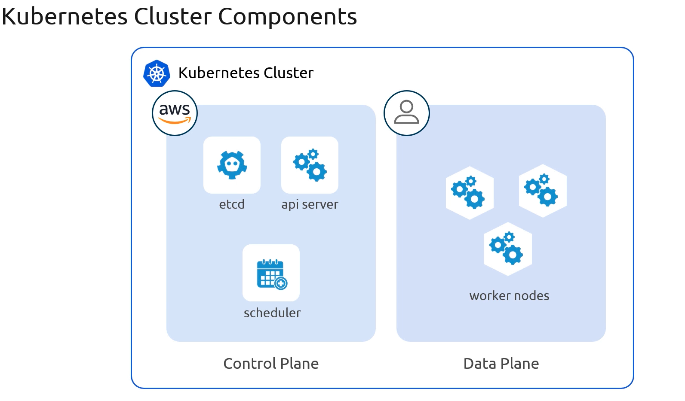
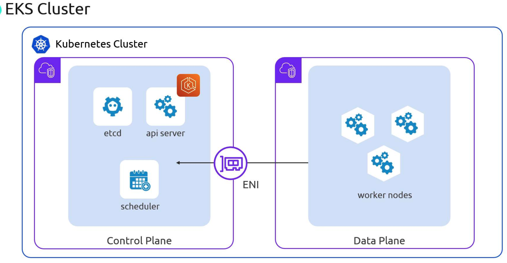

# What is EKS

**Amazon Elastic Kubernetes Service (EKS)** is AWS’s managed Kubernetes offering. By handling the control plane—`API servers`, `etcd`, `schedulers`, `controllers`—EKS lets you focus on deploying and operating your containerized workloads. 
>Unlike a self-managed Kubernetes cluster, Amazon EKS splits responsibilities: 
**AWS manages the control plane**, while **you maintain the data plane in your own AWS account**.

## Kubernetes Cluster Architecture

A standard Kubernetes cluster consists of two main layers:

1. Control Plane
    -   etcd (the key/value store)
    -   API Server
    -   Scheduler
    -   Controller Manager

2.  Data Plane
    -   Worker nodes (EC2 instances or AWS Fargate)
    -   Pods and containers

## EKS Shared Responsibility Model

With Amazon EKS, AWS takes care of the **highly available**, **secure control plane**, while you manage your **worker nodes** and **application workloads**.

|AWS Manages (Control Plane)| You Manage (Data Plane)|
|---|---|
|etcd, API Server, Scheduler|Worker Nodes (EC2 instances or Fargate)|
|Controller Manager|Operating System patches & node upgrades|
|Control Plane VPC networking & HA|Kubernetes workloads, Namespaces, RBAC, CRDs|
|Automatic backups, updates & scaling|Pod configuration, Security Groups, IAM roles|

>**Note:** AWS provisions a dedicated VPC for the control plane and connects it to your VPC using cross-account Elastic Network Interfaces (ENIs).

## Control Plane ↔ Data Plane Communication

Under the hood, your worker nodes in one VPC communicate with the managed control plane in another VPC. AWS uses cross-account ENIs to bridge the two, similar to connecting two physical network switches with a cable:

-   Your Network: Worker nodes plugged into your VPC.
-   AWS’s Network: Control plane components housed in AWS’s VPC.

This link ensures secure, low-latency API calls and etcd reads/writes from your pods to the managed control plane.

>**Warning:** Make sure your VPC subnets, route tables, and security groups allow traffic between your nodes and the control plane ENIs. Misconfigured rules can cause API connectivity failures.