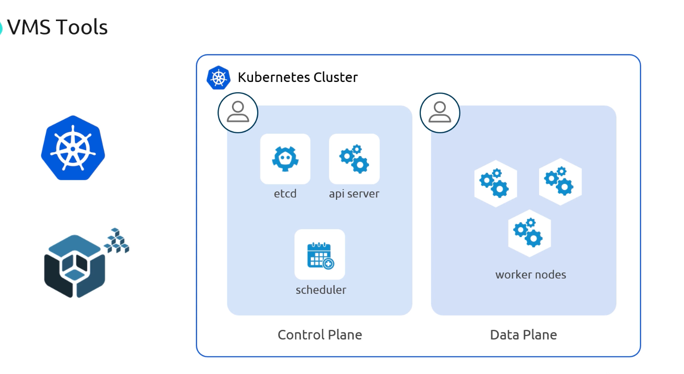
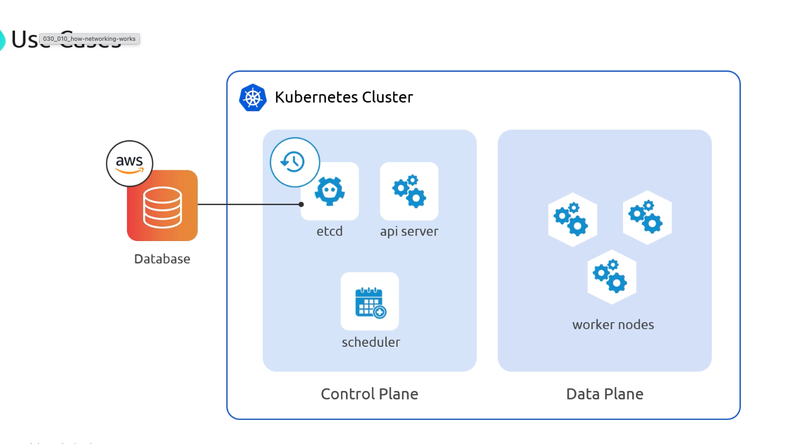
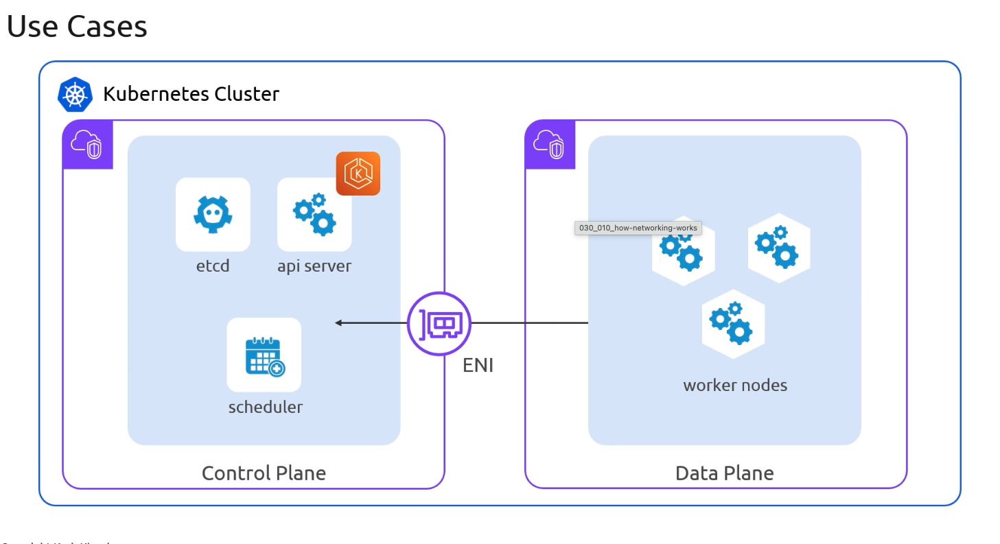
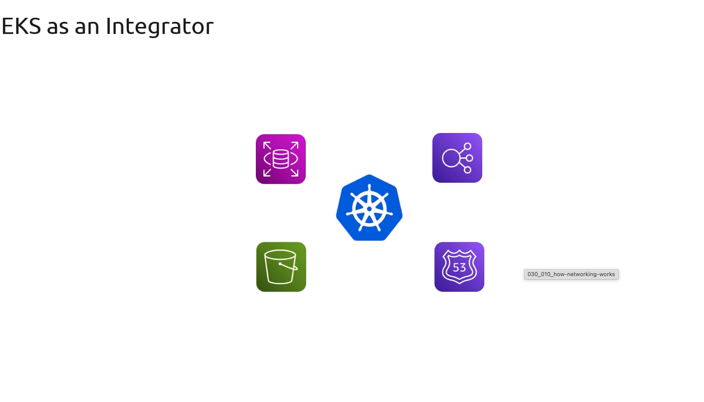

# Common Use Cases

>This lesson compares self-managed Kubernetes on EC2 with a managed EKS control plane, and shows how EKS integrates with other AWS services.

## 1. Self-Managed Kubernetes on EC2 Instance

With a self-managed approach, you provision EC2 VMs for both the **control plane** (etcd, API server, scheduler) and worker nodes. 
-   Tools like `KOPS` or `KubeSpray` automate provisioning, but you remain fully responsible for cluster operations.

| Aspect        | Benefits                                                                | Drawbacks                                                     |
| ------------- | ----------------------------------------------------------------------- | ------------------------------------------------------------- |
| Control Plane | Full control over scheduler flags, version upgrades, and cluster sizing | You must manage etcd backups, restores, HA, and patching      |
| Worker Nodes  | Flexibility to spin up large or temporary clusters                      | Operational overhead for OS updates, security, and monitoring |

>If you lose etcd data, your entire Kubernetes cluster state is irretrievably lost. Implement reliable backup and restore procedures.

## 2. Kubernetes Cluster Architecture
etcd is the distributed key-value store that underpins every Kubernetes cluster. It holds all resource definitions, pod states, and configuration data. Managing etcd yourself requires careful handling of backups, restores, and high availability.

>A production etcd cluster should run in a highly available configuration (odd number of nodes) and have automated snapshot backups.

## 3. Amazon EKS (Managed Control Plane)

Amazon EKS shifts control plane (including etcd) management to AWS. You still launch and scale worker nodes within your VPC—either on EC2 or with Fargate—but AWS handles availability, upgrades, and patching for you.

**AWS Handles**

* etcd backups, restores, and multi-AZ high availability
* Control plane version upgrades and security patching
* API server scaling under load

**You Handle**

* Worker node provisioning, scaling, and lifecycle
* VPC/subnet configuration, IAM roles, and ENI permissions

## 4. Integrating Kubernetes with AWS Services

Most organizations deploy Kubernetes alongside other AWS services—RDS for databases, S3 for object storage, ELB for ingress, and Route 53 for DNS. EKS simplifies service discovery, permissions, and network integration.

* Amazon RDS and Aurora for managed relational databases
* Amazon S3 for persistent object storage and backups
* Elastic Load Balancing to expose Ingress controllers
* Amazon Route 53 for internal and external DNS routing

