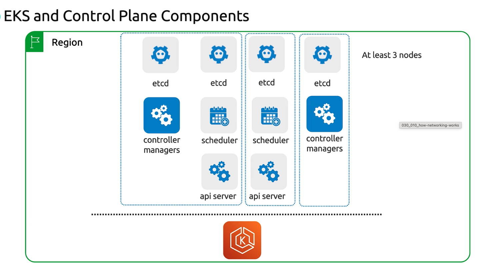
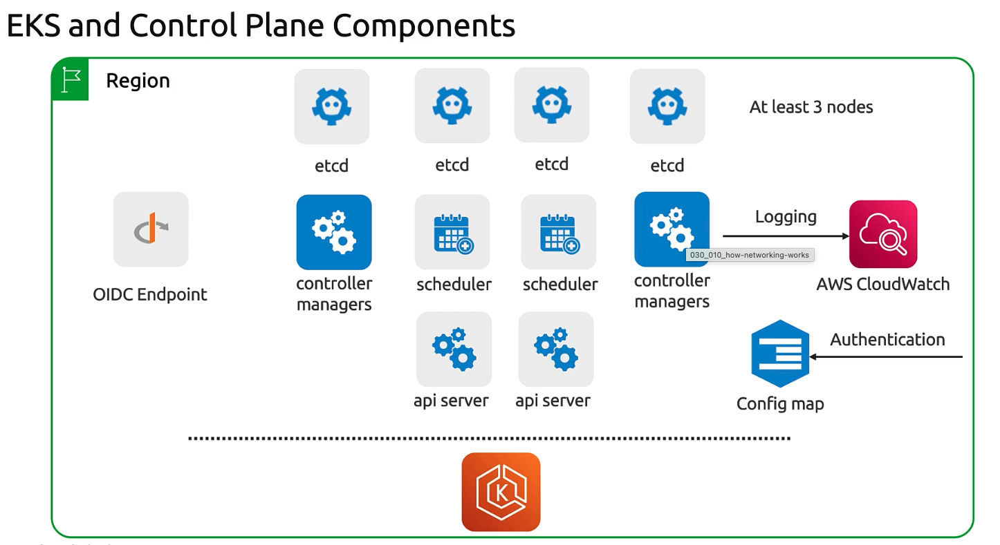
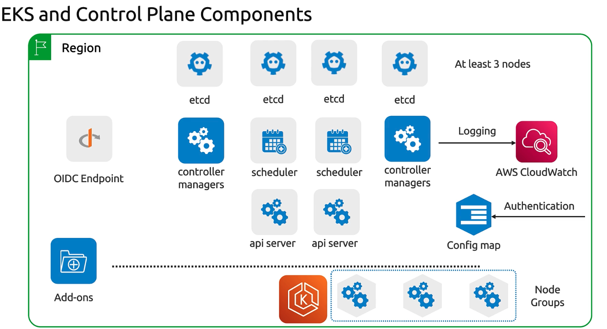

# Architecture

> This article explores the Amazon EKS control plane components and their management for launching an EKS cluster.

## Kubernetes Control Plane Components

When you create an Amazon EKS cluster, AWS automatically sets up the core Kubernetes control plane, ensuring high availability and fault tolerance:

| Component| Role|
| ------------------- | --------------------------------------------------------------------------------------------------------------------------------------------- |
| etcd                | Distributed key–value store. EKS runs a minimum of three etcd nodes (up to five for extra resilience) to maintain quorum and leader election. |
| API Servers         | Multiple instances handle all Kubernetes API requests (e.g., `kubectl` commands for pods, deployments, services).                             |
| Controller Managers | Execute control loops to reconcile the desired and current cluster state (for example, maintaining the right number of pod replicas).         |
| Schedulers          | Assign pods to nodes based on resource requirements, node labels, taints, and affinity rules.                                                 |

>Amazon EKS automatically manages patching, scaling, and failover for these control plane components so you can focus on deploying applications.

## Regional and Availability Zone Distribution

Amazon EKS is a regional service. Each cluster’s control plane is distributed across at least three Availability Zones (AZs) to guarantee high availability:

* **Automatic Failover**: If one AZ becomes unavailable, etcd maintains quorum (read-only until a new leader is elected), and API servers route traffic through healthy AZs.
* **Cross-AZ Replication**: AWS handles networking, latency optimization, and data replication between AZs without any additional configuration.

## AWS-Specific Control Plane Integrations

Beyond the standard Kubernetes control plane, EKS includes built-in AWS integrations to streamline authentication, logging, and access control:

| Integration|Purpose| Configuration|
| ---------------------- | ---------------------------------------------------------------------------------- | ---------------------------------------------- |
| OIDC Endpoint          | Issues tokens for IAM-to-Kubernetes identity mapping                               | Enabled by default when you create the cluster |
| CloudWatch Logs        | Forwards API server, controller manager, and scheduler logs to Amazon CloudWatch   | Configure via the EKS console or AWS CLI       |
| EKS Authentication API | Defines which IAM principals can access your cluster (replaces aws-auth ConfigMap) | Managed through IAM roles and policies         |

## EKS Data Plane Extensions

EKS extends the Kubernetes API with custom resources and services in your AWS account, handling your workloads and cluster add-ons:

| Extension   | Description                                                                                              |
| ----------- | -------------------------------------------------------------------------------------------------------- |
| Node Groups | Managed or self-managed EC2 instances (Linux/Windows) where your pods run. Supports Auto Scaling groups. |
| Add-ons     | Core cluster services (CoreDNS, kube-proxy, VPC CNI) deployed as pods. Managed via the EKS Add-on API.   |

These data plane components reside within your AWS account, giving you control over scaling, updates, and monitoring.

