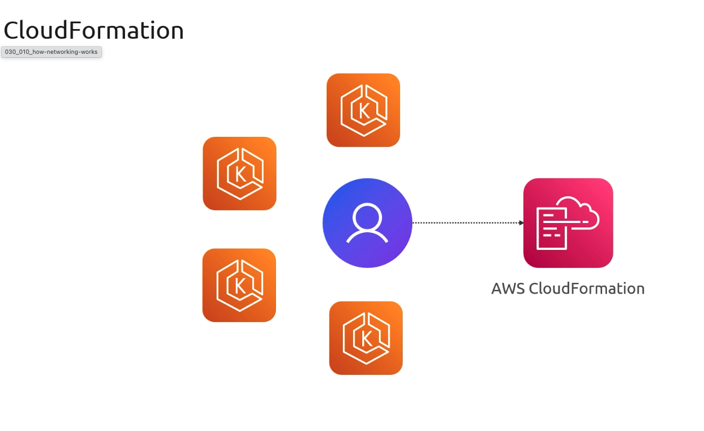
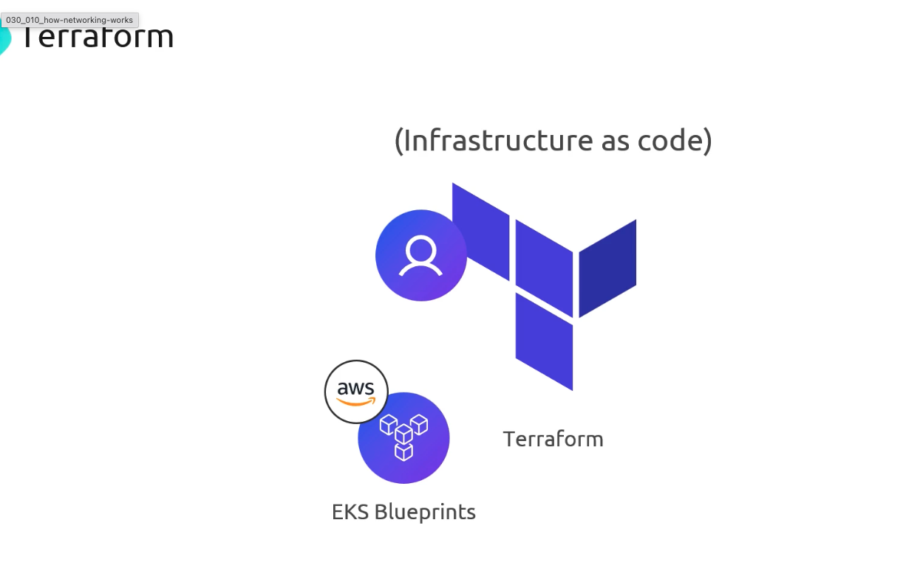
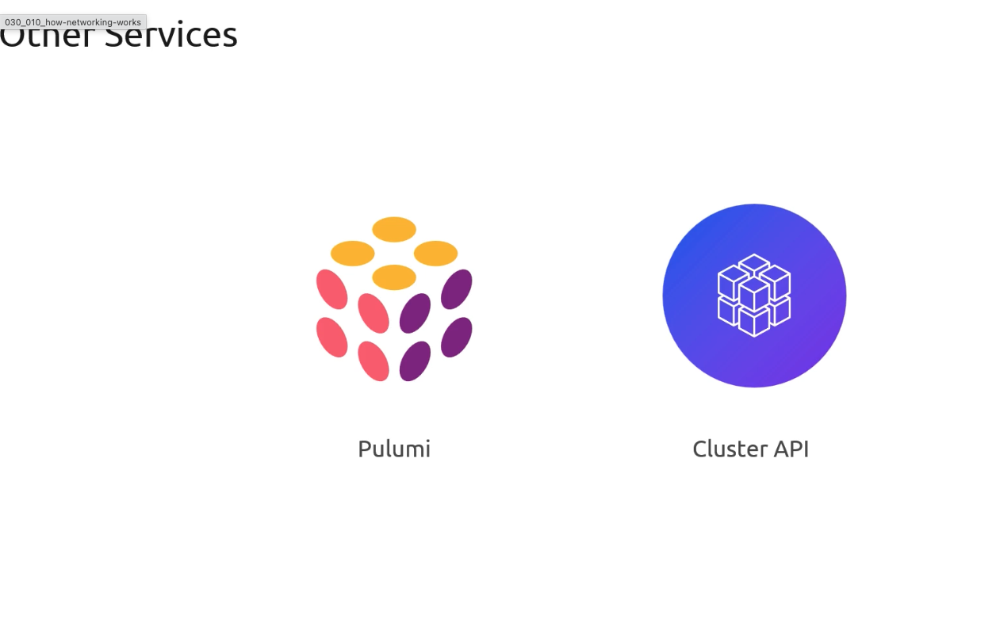

# Deployment Options

> This article discusses various methods for managing Amazon EKS clusters, including AWS Console, CloudFormation, Terraform, and other tools.

## 1. AWS Management Console

Create an EKS cluster directly in the AWS Console by navigating to **Kubernetes (EKS)**, clicking **Create cluster**, and completing the forms for **Cluster name**, **Networking**, **Node groups**, and **Permissions**.

Pros and cons:

| Pros                              | Cons                                    |
| --------------------------------- | --------------------------------------- |
| No coding required                | Manual steps; low repeatability         |
| Visual feedback for each resource | Hard to automate CI/CD pipelines        |
| Good for learning and demos       | Inconsistent environment configurations |

## 2. AWS CloudFormation

Define your EKS infrastructure as code using CloudFormation YAML/JSON or the AWS Cloud Development Kit (CDK).

* **CloudFormation templates**: Hand-craft IAM roles, VPCs, subnets, security groups, and EKS resources.
* **AWS CDK**: Write TypeScript, Python, Java, or .NET code that synthesizes into CloudFormation.

| Feature               | CloudFormation | AWS CDK                        |
| --------------------- | -------------- | ------------------------------ |
| Syntax                | YAML / JSON    | TypeScript, Python, Java, .NET |
| Drift detection       | ✅              | ✅ via synthesized templates    |
| High-level constructs | Limited        | Rich L2/L3 abstractions        |

## 3. Terraform

Terraform uses declarative HCL to provision EKS clusters. Leverage community or official modules from the Terraform Registry and AWS IaC Blueprints for best practices out of the box.

| Feature          | Details                                                                         |
| ---------------- | ------------------------------------------------------------------------------- |
| Language         | HCL                                                                             |
| Official Modules | [EKS Blueprints GitHub](https://github.com/aws-ia/terraform-aws-eks-blueprints) |
| State Backend    | S3 + DynamoDB for locking                                                       |
| Responsibilities | AWS API access, credentials, state security, backend config   

                  |

## 4. Other Tools and Services

Several third-party and community-driven tools can simplify EKS cluster provisioning:

| Tool           | Language / Approach          | Description                                                      |
| -------------- | ---------------------------- | ---------------------------------------------------------------- |
| Pulumi         | Go, Python, TypeScript, .NET | Write IaC in general-purpose languages                           |
| Cluster API    | Kubernetes manifests (CRDs)  | Manage cluster lifecycle via Kubernetes operators                |
| AWS CLI        | Shell                        | Script `aws eks create-cluster …` with full AWS service access   |
| SaaS Providers | N/A                          | Hosted control planes or operators that wrap Terraform/API calls |

