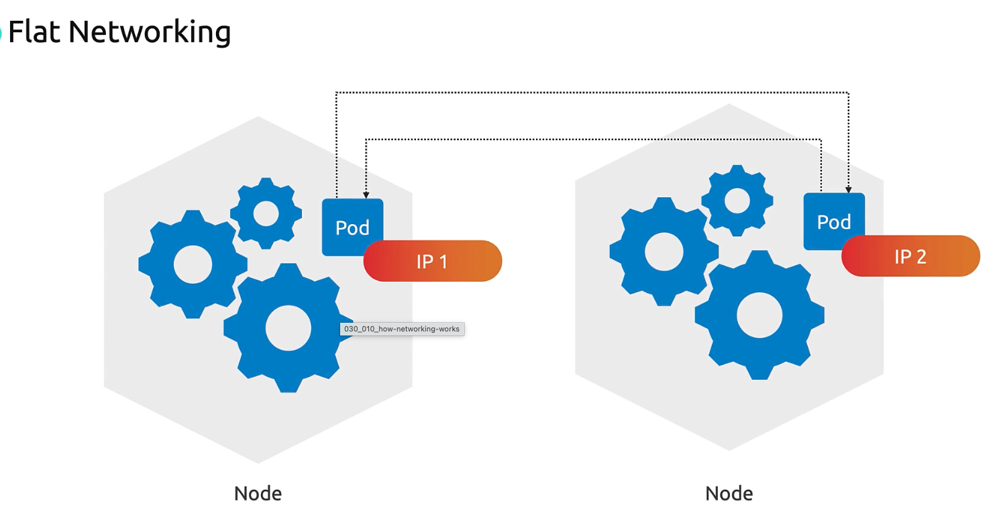
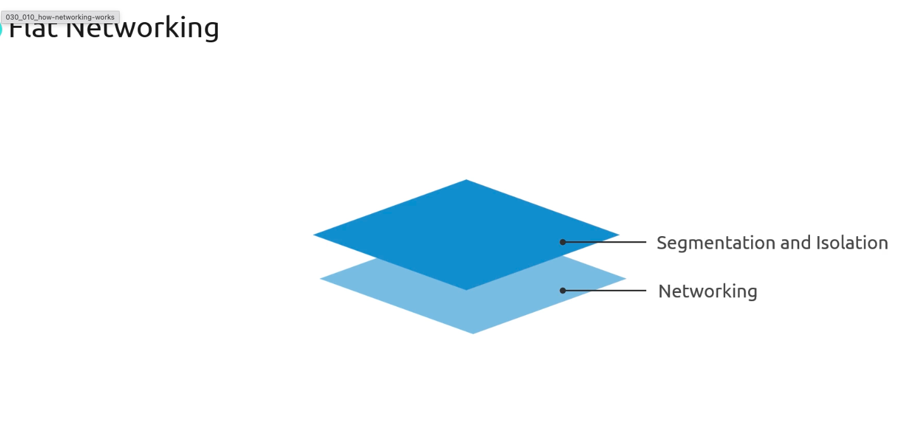
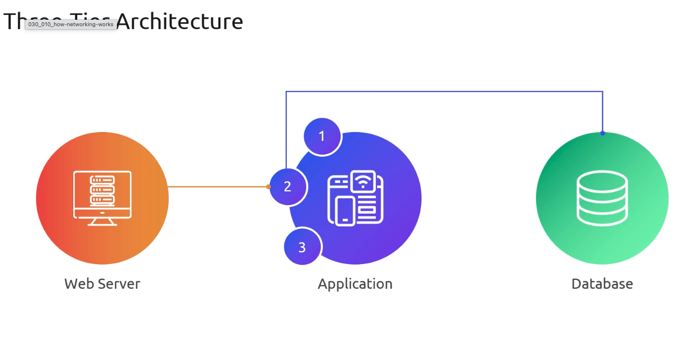
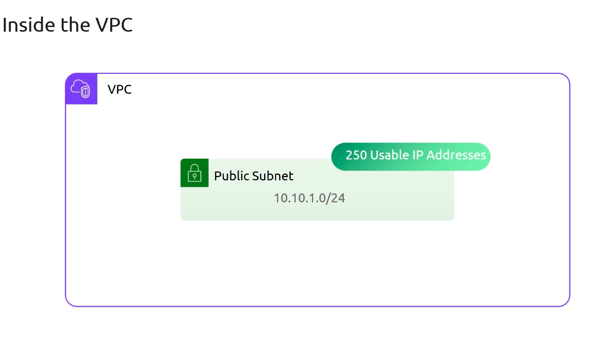
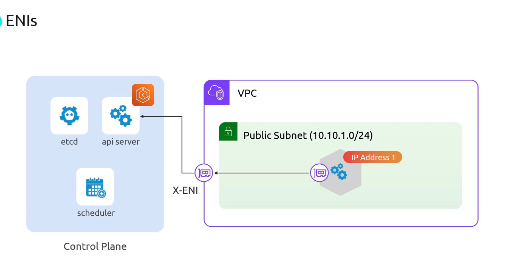
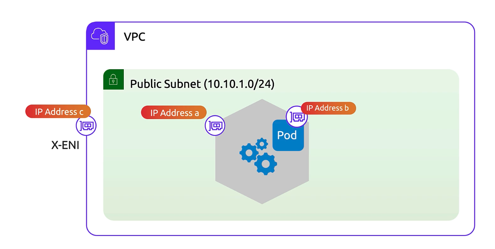
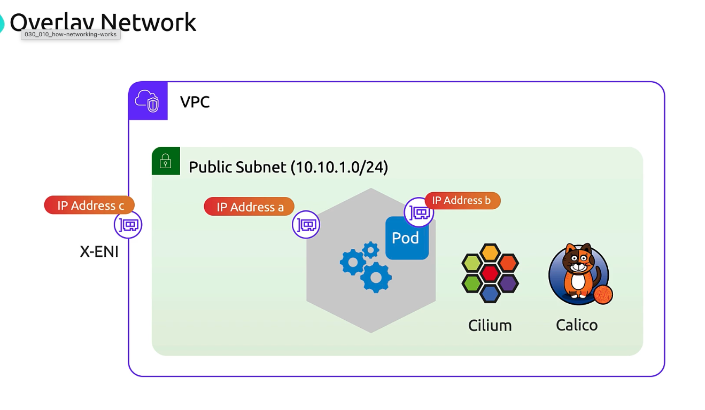
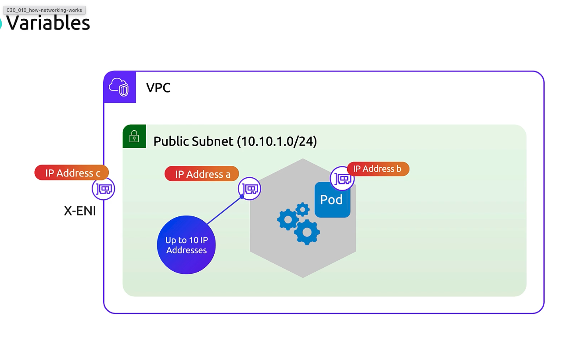

# Networking

> This article explains Kubernetes networking on AWS, focusing on flat pod networks, VPCs, ENIs, and CNI plugins for effective IP management in EKS deployments.

## Flat Networking in Kubernetes

Kubernetes mandates a flat pod network: every pod must have a unique IP and be able to reach any other pod directly, without NAT or VLANs. All segmentation and isolation occur via higher-level constructs like NetworkPolicies.

This stands in contrast to traditional three-tier architectures, where web, app, and database tiers each live in separate subnets. In Kubernetes, pods share a single IP space, and you enforce fine-grained controls using native policies.

## AWS VPC and Subnets

AWS uses a Virtual Private Cloud (VPC) as your networking boundary. Inside a VPC, subnets carve out IP ranges for resources.

Example:

* VPC CIDR: `10.10.0.0/16`
* Subnet CIDR: `10.10.1.0/24` (≈250 usable IPs after AWS reservations)

>Choose subnet CIDRs with enough headroom for both node ENIs and pod IP assignments when using the AWS VPC CNI.

## Nodes, ENIs, and API Server Connectivity

Each EKS node (EC2 instance) attaches an Elastic Network Interface (ENI) in your VPC. AWS also adds a cross-account ENI (X-ENI) so nodes can reach the Amazon-hosted control plane:

* **Node ENI**\
  Assigned dynamically to each worker node for VPC communications.
* **X-ENI**\
  Enables secure API traffic from your nodes to the EKS control plane outside your account.

When a node starts, it authenticates against the API server via its ENI, with traffic routed through the X-ENI.

## Pod IP Allocation with AWS VPC CNI

The  [AWS VPC CNI plugin](https://github.com/aws/amazon-vpc-cni-k8s) assigns each pod an IP from your VPC subnet by adding secondary IPs to the node’s ENI. Internally, the Linux kernel routes those addresses into pod network namespaces.

Key characteristics:

* 1 VPC IP per pod
* Up to N secondary IPs per ENI (instance-type dependent)
* Leverages AWS’s network fabric—no overlays or tunnels required

## Overlay Networking Alternatives

If you’d rather not consume VPC IPs for pods, consider overlay CNIs such as Flannel, Cilium, or Calico. They allocate pod IPs from an independent CIDR and encapsulate traffic between nodes.

| Plugin| Pod IP Source | Overlay | Encapsulation Overhead  |
| ----------- | ------------- | ------- | ----------------------- |
| AWS VPC CNI | VPC subnet    | No      | Low                     |
| Flannel     | Custom CIDR   | Yes     | Medium (VXLAN)          |
| Cilium      | Custom CIDR   | Yes     | Variable (e.g., Geneve) |
| Calico      | Custom CIDR   | Yes     | Low (IP-in-IP)          |

Pros of overlays:

* Preserve VPC IP space
* Decouple pod addressing from VPC design

Cons:

* Extra encapsulation latency
* Additional configuration and monitoring

## Managing IP Consumption

When using the AWS VPC CNI, plan your subnet sizes and pods-per-node carefully. Each ENI has a maximum number of secondary IPs—and network throughput limits are tied to instance type.

>Depending on the node size, ENIs can have up to 10 IP Addresses