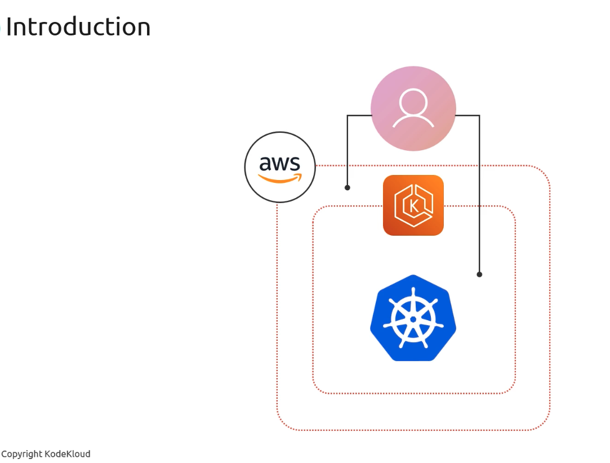
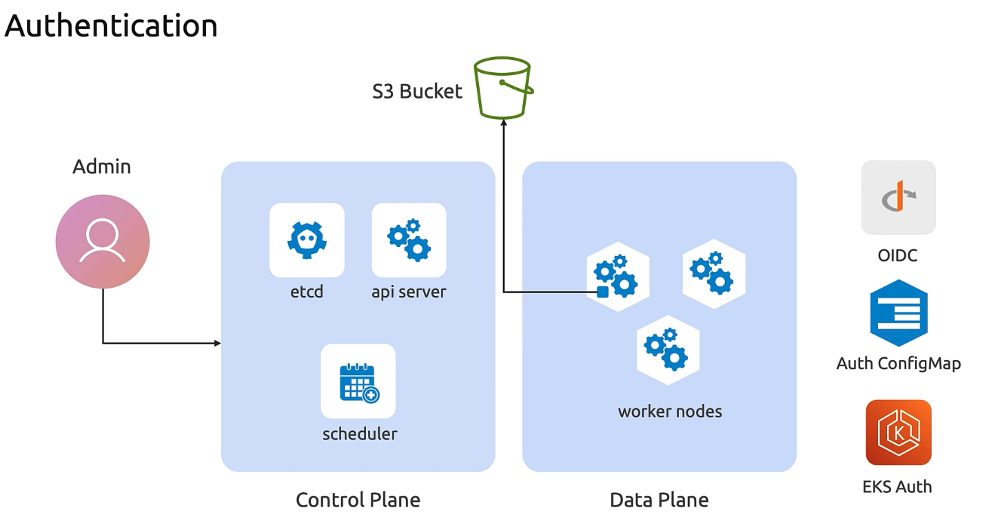

# Authentication

> This article explains the authentication mechanisms for accessing an Amazon EKS cluster using Kubernetes and AWS IAM.

Accessing an Amazon EKS cluster involves both Kubernetes and AWS IAM mechanisms working together. Since EKS control plane components (etcd, API server, scheduler) run in AWS-managed infrastructure and your worker nodes run in your account, authentication spans two domains:

* Kubernetes service accounts obtain AWS credentials via OIDC.
* IAM users and roles are mapped to Kubernetes RBAC subjects using the `aws-auth` ConfigMap.
* EKS IAM APIs enforce control-plane permissions for cluster operations.





## Key Components of EKS Authentication

| Component          | Purpose                                              | Example Use Case                          |
| ------------------ | ---------------------------------------------------- | ----------------------------------------- |
| OIDC Provider      | Federates Kubernetes service accounts with IAM roles | Pod-specific S3 or DynamoDB access        |
| aws-auth ConfigMap | Maps IAM users/roles to Kubernetes RBAC identities   | Grant team members `kubectl` permissions  |
| EKS IAM APIs       | Authorizes control-plane operations                  | Creating/updating clusters and nodegroups |



***


## 1. OpenID Connect (OIDC)

Amazon EKS uses OIDC to exchange a Kubernetes service account token for temporary AWS credentials. Follow these steps:

1. **Associate an OIDC provider**
   ```bash  theme={null}
   eksctl utils associate-iam-oidc-provider \
     --cluster my-cluster \
     --approve
   ```
2. **Create an IAM role with a trust policy**
   ```json  theme={null}
   {
     "Version": "2012-10-17",
     "Statement": [{
       "Effect": "Allow",
       "Principal": {
         "Federated": "arn:aws:iam::123456789012:oidc-provider/oidc.eks.us-west-2.amazonaws.com/id/EXAMPLED539D4633E53DE1B716D3041E"
       },
       "Action": "sts:AssumeRoleWithWebIdentity",
       "Condition": {
         "StringEquals": {
           "oidc.eks.us-west-2.amazonaws.com/id/EXAMPLED539D4633E53DE1B716D3041E:sub": "system:serviceaccount:default:my-service-account"
         }
       }
     }]
   }
   ```
3. **Annotate your Kubernetes service account**
   ```yaml  theme={null}
   apiVersion: v1
   kind: ServiceAccount
   metadata:
     name: my-service-account
     namespace: default
     annotations:
       eks.amazonaws.com/role-arn: arn:aws:iam::123456789012:role/MyPodRole
   ```

This grants pods using `my-service-account` the permissions defined in `MyPodRole`.

***

## 2. aws-auth ConfigMap

The `aws-auth` ConfigMap defines which IAM users and roles can interact with the Kubernetes API server.\
Updating it carefully is crucial:

```bash  theme={null}
kubectl edit -n kube-system configmap/aws-auth
```

```yaml  theme={null}
mapRoles: |
  - rolearn: arn:aws:iam::123456789012:role/TeamRole
    username: team-user
    groups:
      - system:masters
mapUsers: |
  - userarn: arn:aws:iam::123456789012:user/Alice
    username: alice
    groups:
      - developers
```

***

## 3. EKS IAM APIs

Every EKS control-plane operation—like creating or scaling a node group—uses AWS IAM behind the scenes:

* **Cluster creation**: Calls `CreateCluster`, `DescribeCluster`.
* **Node group updates**: Calls `UpdateNodegroupConfig`, `DeleteNodegroup`.
* **Add-ons and attachments**: Manage managed add-ons via `CreateAddon`, `AssociateEncryptionConfig`.

Permissions are granted through IAM policies attached to the IAM principal making the API calls (CLI user, Terraform role, etc.).

***
