# Prefix Delegation

> This guide explores **AWS VPC CNI plugin** configuration options to enhance pod IP capacity and improve scaling speed in Amazon EKS.

## ENI Attachment and Pod IP Allocation

In EKS, each worker node attaches an Elastic Network Interface (ENI) to the VPC subnet. The ENI’s primary IP serves the node itself (kubelet, kube-proxy, etc.), while secondary IPs are allocated to pods.

When a pod launches, the VPC CNI plugin requests a free IP from the node’s ENIs. Since each ENI can hold multiple secondary IPs, you can run many pods off one physical interface:

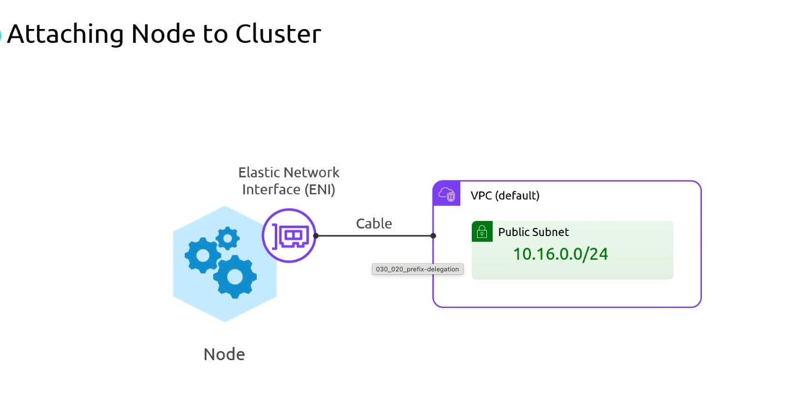

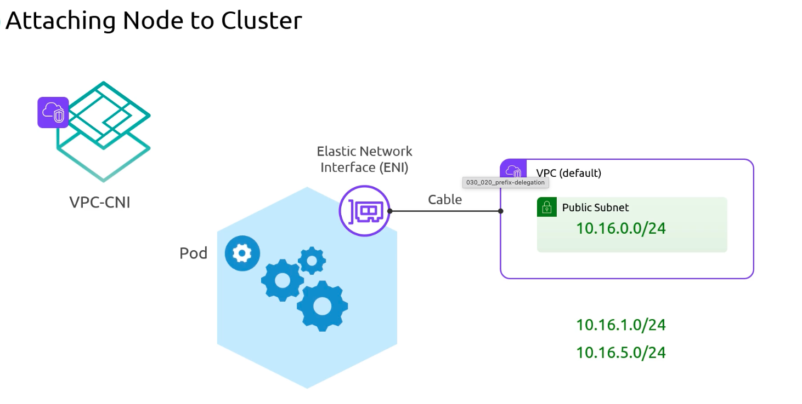

However, EC2 instance types impose limits on both the number of ENIs and IPs per ENI. For example, an instance with **1 ENI** and **5 IP addresses** will fill all addresses once you schedule four pods (plus the primary). Further pods cannot get an IP until another ENI attaches, which can take tens of seconds or more—and if you hit the maximum ENIs, pods remain `Pending`.

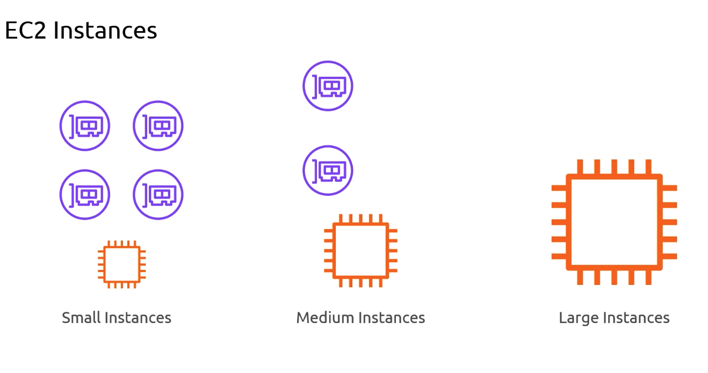
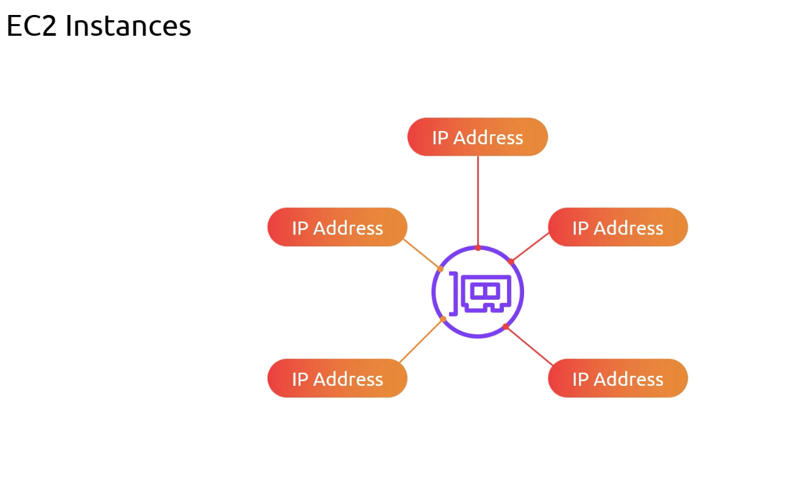
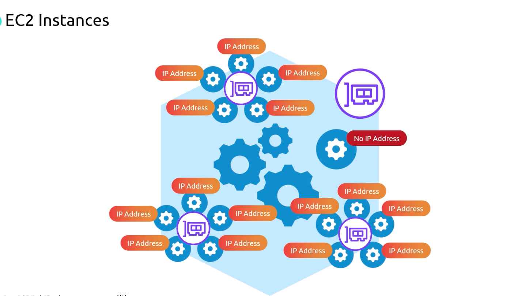

You can either move to larger instance types (with higher ENI/IP limits) or enable **Prefix Delegation** to boost pod IP capacity per ENI:

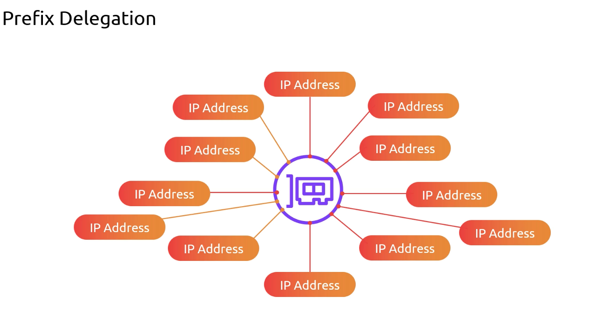

### Example Capacities

| Max ENIs per instance | IPs per ENI | Max Pods (without prefix delegation) |
| --------------------- | ----------- | ------------------------------------ |
| 1                     | 5           | 4                                    |
| 2                     | 5           | 9                                    |

## Warm ENI and Warm IP Pools

Attaching ENIs is relatively slow. To mitigate scheduling delays, the VPC CNI lets you keep extra resources “warm”:

### WARM\_ENI\_TARGET

This setting ensures a specified number of unused ENIs remain attached. For example, `WARM_ENI_TARGET=1` keeps one spare ENI ready. If you’re using 3 of 5 IPs on your primary ENI, the CNI will pre-attach a second ENI so that new pods get IPs immediately.

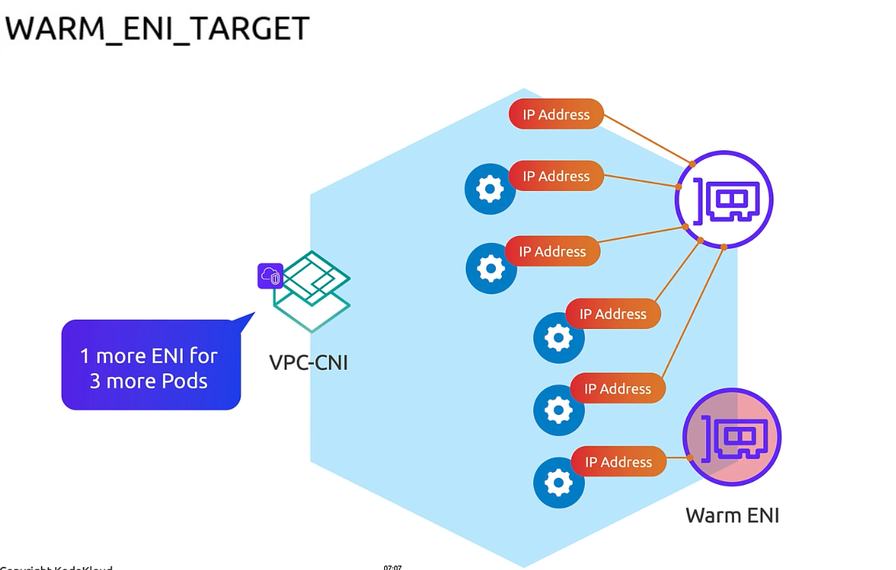


### WARM\_IP\_TARGET

Instead of full ENIs, you can maintain a pool of free IPs across all ENIs. The CNI calculates how many ENIs are needed to meet the target and pre-allocates them.

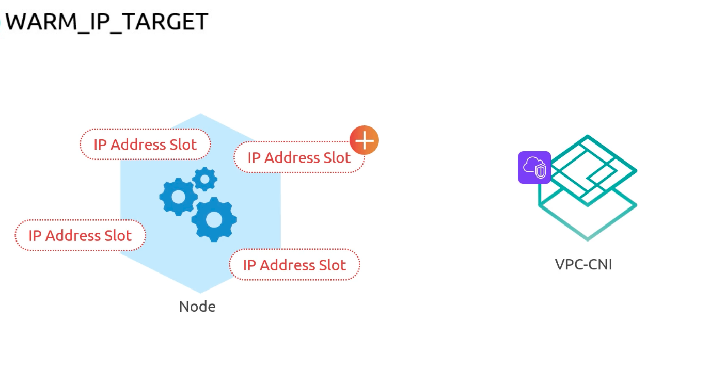

* On an instance with **5 IPs/ENI**, setting `WARM_IP_TARGET=10` attaches two ENIs (5 IPs each):

    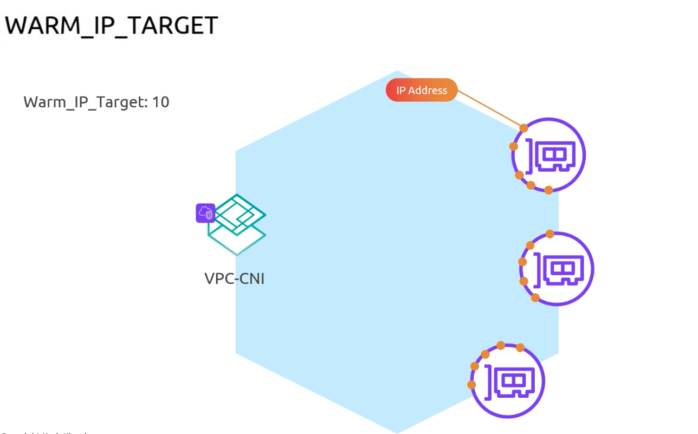

* On larger instances (e.g., 20 IPs/ENI), the same warm IP target can be satisfied by a single ENI.

    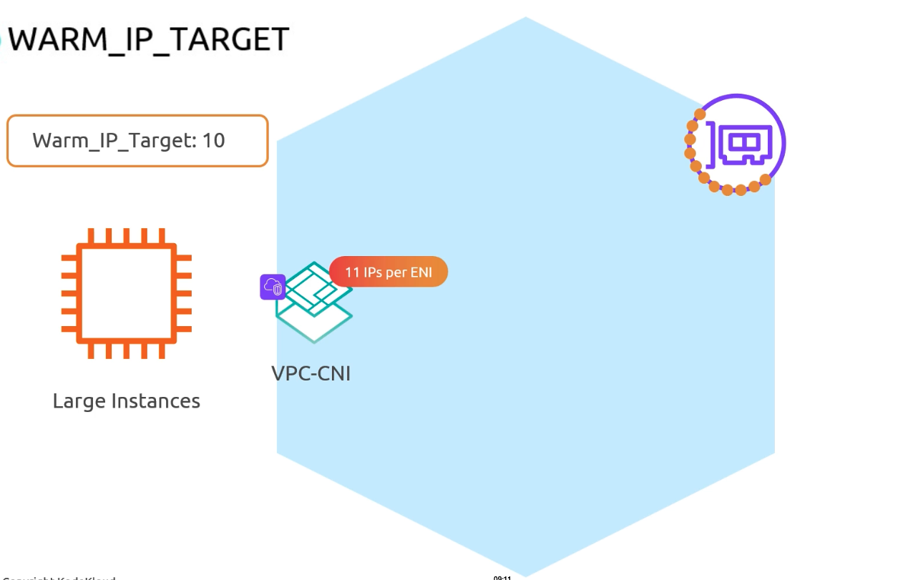


## Prefix Delegation

Prefix Delegation lets each secondary allocation on an ENI be a `/28` block (16 addresses) instead of a single IP. Enable it via the `ENABLE_PREFIX_DELEGATION` environment variable:

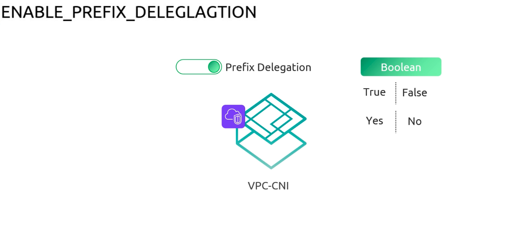

When enabled, the CNI requests a `/28` prefix from the VPC and programs routes so that the node becomes the next hop for all 16 addresses. From one prefix you now get 16 pod IPs:

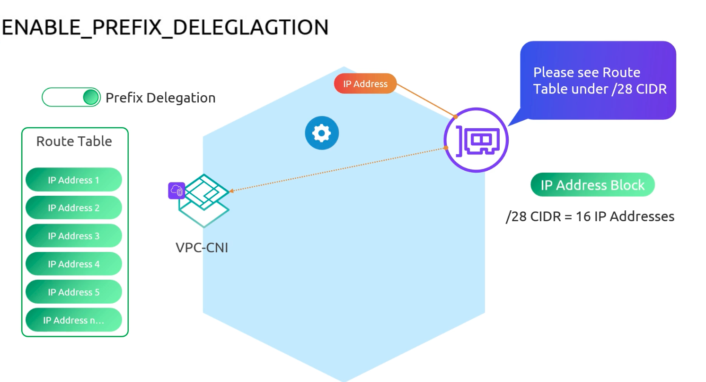


On an ENI limited to 5 IPs (1 primary + 4 secondary), prefix delegation yields 4 × 16 = 64 pod IPs. Adding a second ENI gives another 64, for 128 total—without waiting for new attachments:

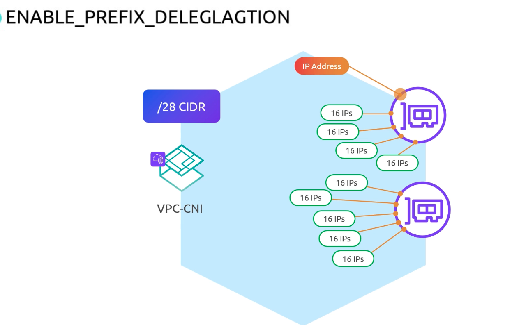

>Enabling prefix delegation is an EKS best practice when you need high pod density per node.


>Your VPC subnet must have available `/28` CIDR blocks. Each delegated prefix consumes one `/28`.


## Real-World Example

1. List your nodes:
   ```bash  theme={null}
   kubectl get nodes
   ```

2. Check attached ENIs and delegated prefixes:
   ```bash  theme={null}
   eksdemo get eni
   ```

3. Sort pods by IP to observe `/28` ranges:
   ```bash  theme={null}
   kubectl get pods -o wide --sort-by='.status.podIP'
   ```
   ```plaintext  theme={null}
   NAME                         READY STATUS  AGE   IP               NODE
   podinfo-7fd777f97c-tjhwd     1/1   Running 4m    192.168.114.27   i-029af76c1ec14277e.us-west-2.compute.internal
   podinfo-7fd777f97c-fpjtk     1/1   Running 4m    192.168.114.28   i-029af76c1ec14277e.us-west-2.compute.internal
   ...
   podinfo-7fd777f97c-zp2kw     1/1   Running 4m    192.168.114.31   i-029af76c1ec14277e.us-west-2.compute.internal
   podinfo-7fd777f97c-dk7nr     1/1   Running 4m    192.168.116.27   i-029af76c1ec14277e.us-west-2.compute.internal
   ...
   podinfo-7fd777f97c-cdmw      1/1   Running 4m    192.168.173.170  i-01d4c98ecb95cdb99.us-west-2.compute.internal
   ```

>You’ll see blocks like `192.168.114.16–31` routed to one ENI. Scaling pods with prefix delegation is significantly faster than single-IP allocation since you avoid repeated ENI attachments.

***

While the AWS VPC CNI plugin offers many tunables, using the defaults plus **Prefix Delegation** is a powerful way to maximize pod IP capacity and accelerate scale-out without resorting to large instance types.
